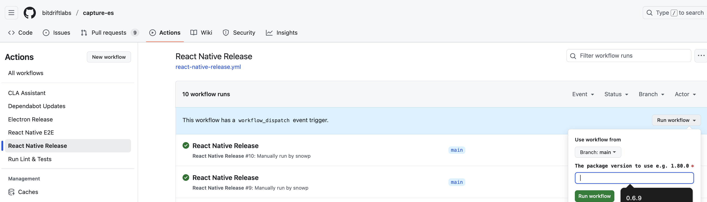

# Releasing

This document explains the process of releasing new versions within capture-es repo

## Release for React Native

1. Get the latest capture-sdk release version, for example [0.17.11](https://github.com/bitdriftlabs/capture-sdk/releases/tag/v0.17.11)
2. Run `scripts/update_rn_capture_version.sh` with the desired version
3. Open and merge PR on [capture-es](https://github.com/bitdriftlabs/capture-es) repo
4. Run Github action [React Native Release](https://github.com/bitdriftlabs/capture-es/actions/workflows/react-native-release.yml)
3. Hit `Run Workflow` button on the right.
4. Keep `main` branch selection, enter version number.
5. The CI job should open a PR e.g. 'chore: release react-native 0.6.11' ([example](https://github.com/bitdriftlabs/capture-es/pull/82)).
6. Close, re-open, approve and merge the PR.
7. Verify that the release with expected version is published at https://www.npmjs.com/package/@bitdrift/react-native
8. Update [release docs](https://docs.bitdrift.io/sdk/releases-react-native) to include latest version. 

